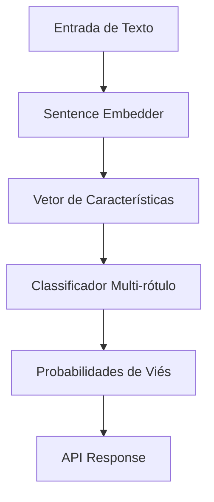

# Arquitetura do Sistema

O **Detector de Viés em RH** é uma aplicação de Machine Learning projetada para identificar linguagem tendenciosa em descrições de vagas.

## Fluxo de Dados

## Componentes

### 1. Geração de Dados (`src/data`)
Responsável por criar datasets sintéticos balanceados para treinamento inicial, utilizando templates e listas de palavras-chave.

### 2. Pipeline de ML (`src/ml`)
- **Embedder**: `all-MiniLM-L6-v2` (Sentence-Transformers) transforma texto em vetores densos.
- **Classificador**: `LogisticRegression` (OneVsRest) treinado para múltiplas classes (`gender`, `age`, `culture`).

### 3. API (`src/api`)
Interface REST construída com FastAPI para servir o modelo.

### 4. MLflow
Gerencia o ciclo de vida dos experimentos, rastreando parâmetros, métricas e artefatos de modelo.
